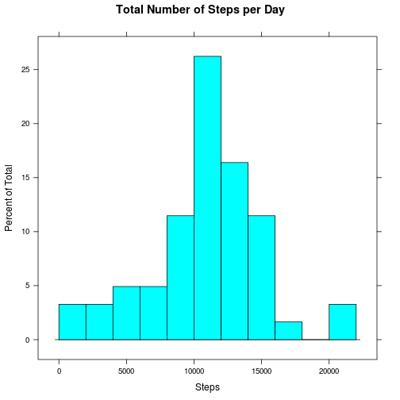
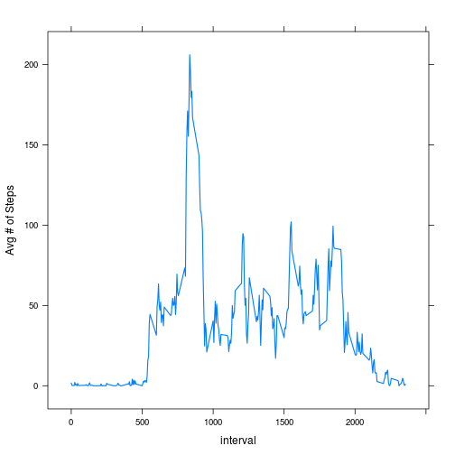
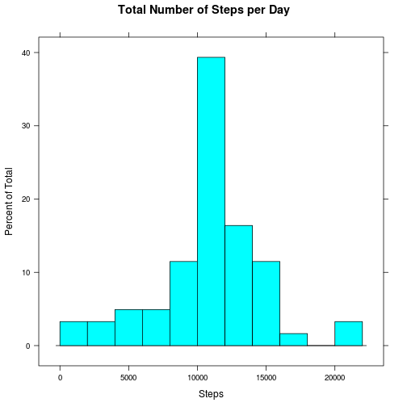
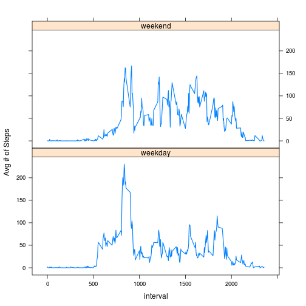

## Loading and preprocessing the data
The data set contains 2 months of readings from a personal activity from
a single anonymous individual collected October 2012 - November 2012.
Data was collected at 5 minute intervals throughout the day and the file
we use includes the number of steps taken in each of these 5 minute intervals.

I acquired the data by cloning the GitHub repository - not sure how to code that
in R, so I'm just going to start by assuming I already have the file.

HTML and markdown (.md) files were made with the command: knit2html("PA1_template.Rmd") in 
the working directory below using RStudio.

### Read the file into a data frame.


```r
setwd("~/repdata/RepData_PeerAssessment1")
it <- read.csv("activity.csv")
```

## What is mean total number of steps taken per day?

* Make a histogram of the total number of steps per day.
* Calculate the mean and median total number of steps per day.


```r
library(lattice)
	#-- disregarding missing values at the moment, get the total per day
tot <- tapply(it$steps, it$date, sum)
	#-- plot the totals
histogram(tot, breaks = 10, main = "Total Number of Steps per Day", xlab = "Steps")
```

 

```r
	#-- get the mean and median total number of steps per day
mean(tot, na.rm = TRUE)
```

```
## [1] 10766.19
```

```r
median(tot, na.rm = TRUE)
```

```
## [1] 10765
```

## What is the average daily activity pattern?

* Make a time series line plot with the 5 min intervals on the x axis and mean number of steps on the y.
* Which time interval had the maximum mean number of steps taken?


```r
ada <- aggregate(it$steps, list(time = it$interval),mean, na.rm = TRUE)
xyplot(x ~ time, data = ada, type = "l", lwd = 1.5, xlab = "interval", ylab = "Avg # of Steps")
```

 

```r
	#-- The five minute interval with the maxiumum average number of steps
ada[which.max(ada$x),]
```

```
##     time        x
## 104  835 206.1698
```

## Imputing missing values
Substituting the mean number of steps per interval for any missing values.


```r
	#-- number of rows with missing values
length(which(is.na(it$steps)))
```

```
## [1] 2304
```

```r
	#-- using ada as the source for the missing values
	#-- substituting the mean for that time period

for(i in 1:nrow(it)){
	if(is.na(it[i,1])){
		int <- it[i,3]
		it[i,1] <- ada[(ada$time == int), 2]
	}
}

	#-- reusing the variables from above, updating with imputed values
tot <- tapply(it$steps, it$date, sum)
	#-- plot the totals
histogram(tot, breaks = 10, main = "Total Number of Steps per Day", xlab = "Steps")
```

 

```r
	#-- get the mean and median total number of steps per day
mean(tot, na.rm = TRUE)
```

```
## [1] 10766.19
```

```r
median(tot, na.rm = TRUE)
```

```
## [1] 10766.19
```
### What has changed after substituting values in for the missing data? 
The total number of steps has increased and the histogram y scale increased a bit.  The overall shape has remained since I substituted the interval specific mean.  The mean and median (which were close before) are now identical.

## Are there differences in activity patterns between weekdays and weekends?

```r
	#-- assign the day of the week by the date
it$day <- weekdays(as.Date(as.character(it$date)))
	#-- recharacterize as weekday or weekend
it$day <- ifelse(it$day %in% c("Sunday", "Saturday"), "weekend", "weekday")
	#-- convert to factor
it$day <-as.factor(it$day)

	#-- average daily activity depending on time of week
ada2 <- aggregate(it$steps, list(time = it$interval, it$day), mean, na.rm = TRUE)
names(ada2) <- c("interval", "day", "steps")

	#-- plot
xyplot(steps ~ interval | day, data = ada2, type = "l", lwd = 1.5, layout = c(1,2), xlab = "interval", ylab = "Avg # of Steps")
```

 
### Answer: 
On the weekends, the subject slept later and moved around more throughout the day.  There was no distinct peak of activity.
